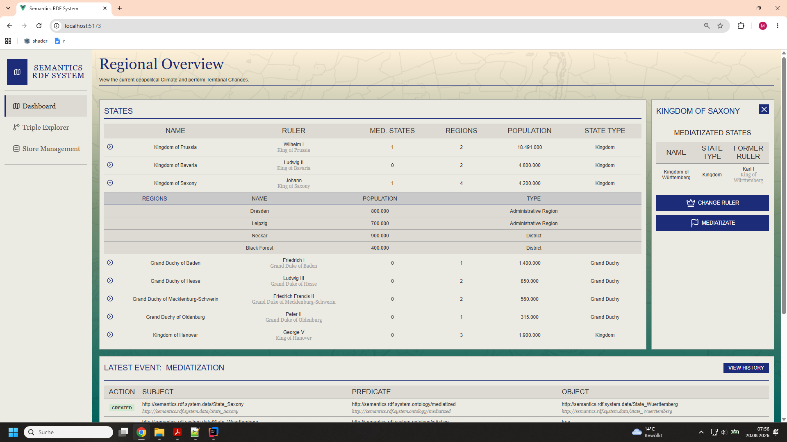
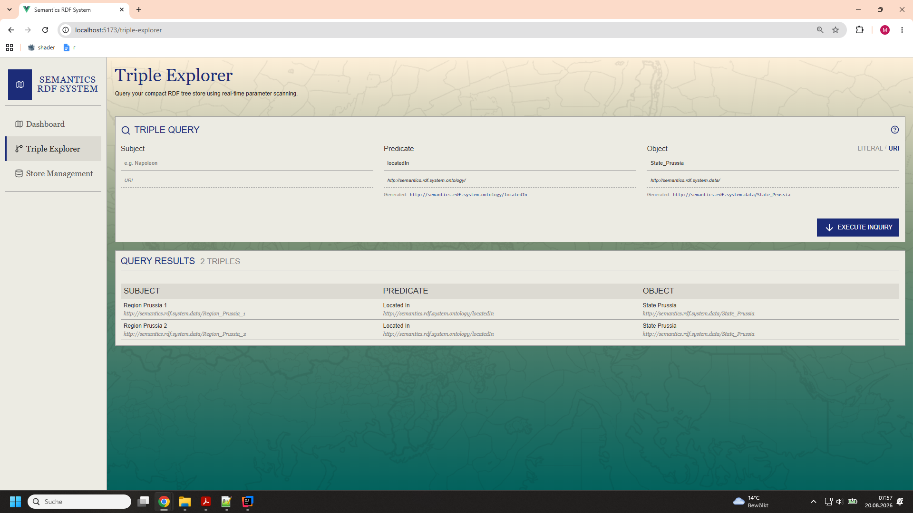
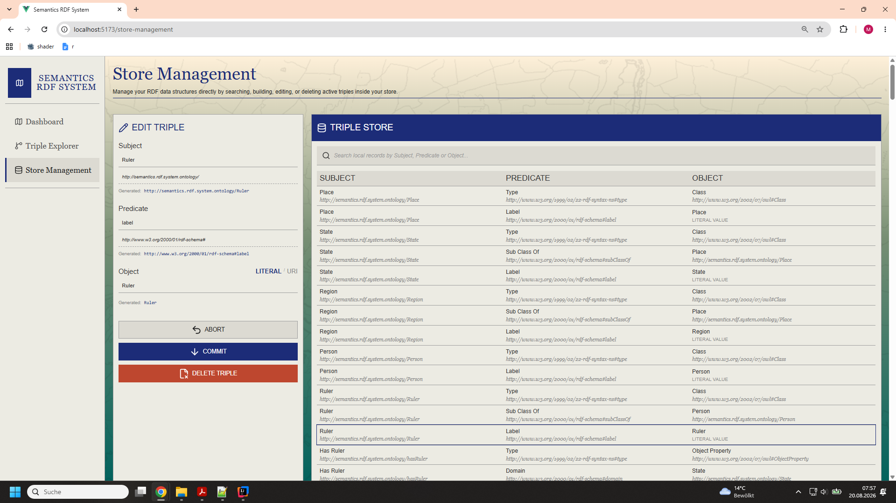

## About

A Java-based Implementation of an RDF Triple Store built on **dynamic K2-Trees (DK2)** and **BMatrix indexing**. Designed to bridge compact data structure theory with practical software engineering, this system uses **RoaringBitmaps** for compressed Bitstring Representations and **Apache Jena** for RDF Serialization. It features full API Abstractions accompanied by a Web-Application built with **Spring Boot** and **Vue.js** to demonstrate it in a real-world Context and to provide Interaction wiht it.

The Implementation is based on the Works of N. R. Brisaboa Et al. as described in the following two Papers:

* N. R. Brisaboa, A. Cerdeira-Pena, G. De Bernardo, and A. Fariña, *"**Revisiting Compact RDF Stores Based on k2-Trees**,"* 2020 Data Compression Conference (DCC), 2020. [DOI: 10.1109/DCC47342.2020.00020](https://doi.org/10.1109/DCC47342.2020.00020)
* N. R. Brisaboa, A. Cerdeira-Pena, D. B. Guillermo, and G. Navarro, *"**Compressed Representation of Dynamic Binary Relations with Applications**,"* arXiv.org, 2017. [arXiv: 1707.02769](https://arxiv.org/abs/1707.02769)

---

### Key Features
* **CRUD**: Supports Create, Read, Update and Delete Operations.
* **Full Pattern Matching**: Read Operations supports all 8 Subject-Predicate-Object (SPO) query patterns (`SPO`, `SP_`, `_PO`, `_P_`, etc.).
* **Persistence & Serialization**: Integrates **Apache Jena ARQ** serialization mechanisms alongside transaction logging for session Persistence.
* **Decoupled Architecture**: Features clear API Boundaries, allowing the store to be embedded cleanly into external applications.
* **Accompanying Web-App**: Features a Full-Stack-Interface with a **Spring Boot** Backend and a **Vue.js** Frontend for querying, store management, and visualization.
* **Expanded examplary Functionality**: Features a Set of additional APIs performing compounded Actions relevant for the provided Web-App.

---

### Tech Stack & Dependencies
* **Backend Core**: Java
* **Web Framework**: Spring Boot
* **Frontend**: Vue.js
* **RDF Serialization**: [Apache Jena ARQ](https://jena.apache.org/documentation/query/)
* **Bitstring Compression**: [RoaringBitmap](https://github.com/RoaringBitmap/RoaringBitmap)

---

## API Documentation

The Triple Store exposes RESTful Endpoints for CRUD operations, query execution, and session management. 

* **Complete Specs**: See [`docs/api.md`](docs/api.md) for Details, Request/Response Payloads and Query Parameters.

---

## Web Application

The Repository includes a Web-Application designed to demonstrate the Store's Capabilities in a practical Environment.
The Applications models the territorial Restructuring of the german Territories at the Beginning of the 19th Century.

 

### Features
* **Interactive Querying**: Execute Pattern-based Triple Queries.
* **Live Store Management**: Add/Delete or modify individual Triples.
* **State Management**: View State Changes and trigger State Mediatizations, State Foundings or Ruler Changes.
* **Action History**: View a History of past State Actions.

For instructions on running the Web-Application, see the [Startup Guide](docs/startup.md).

---

## Known Limitations & Problems

While the current Implementation proves the feasibility of dynamic K2-Trees embedded into the BMatrix-Indexing-Strategy in a native Java environment, several Problems are still present:

* **Unbound Predicate Scans (`_P_`)**: Because Triples are currrently unordered in their respective Matrices, Predicates lack a global spatial Index, leading to unbound Predicate-Queries requirying a full Matrix-Scan. 
* **Object-Bloat**: Managing the Tree-and Traversal-Structures as individual Java Objects creates a significant Pointer Overhead on the heap for large graphs (>=1M triples).
